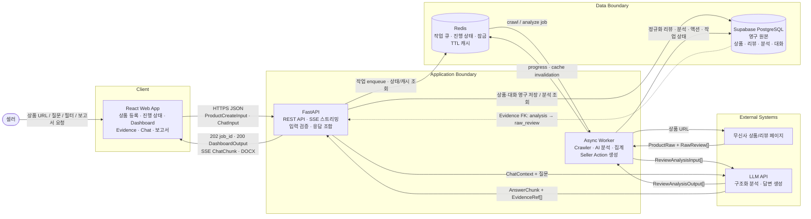
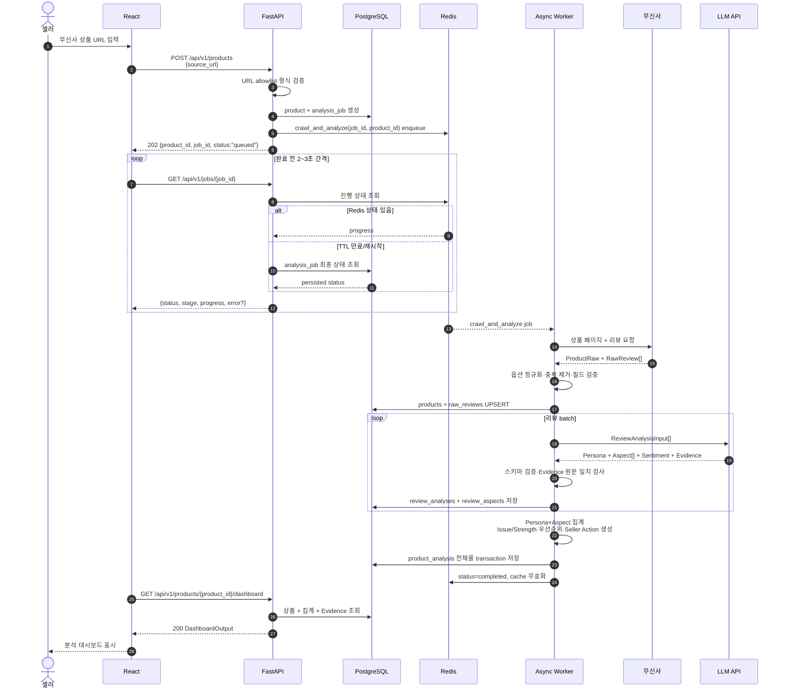
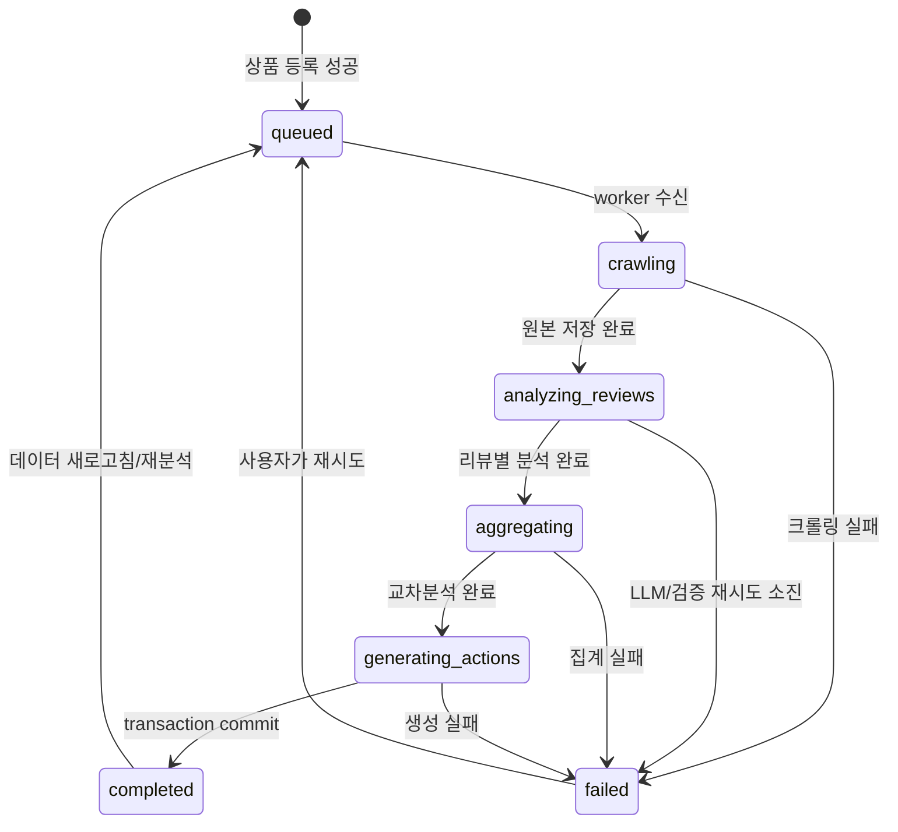
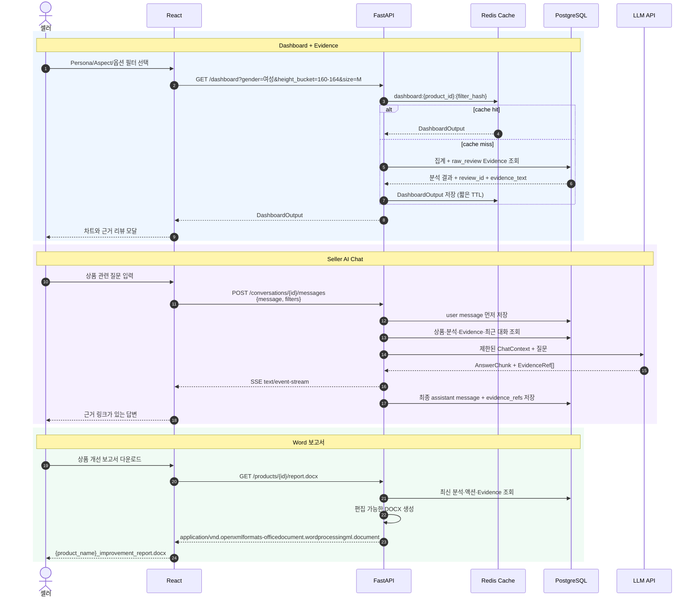
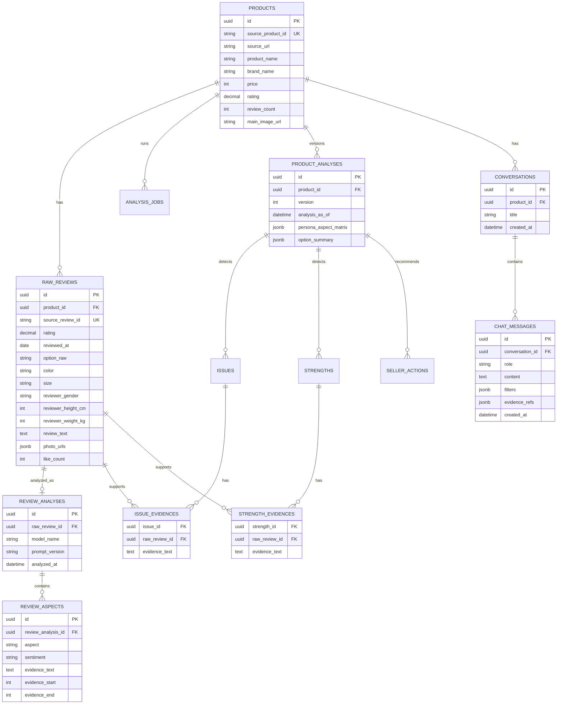
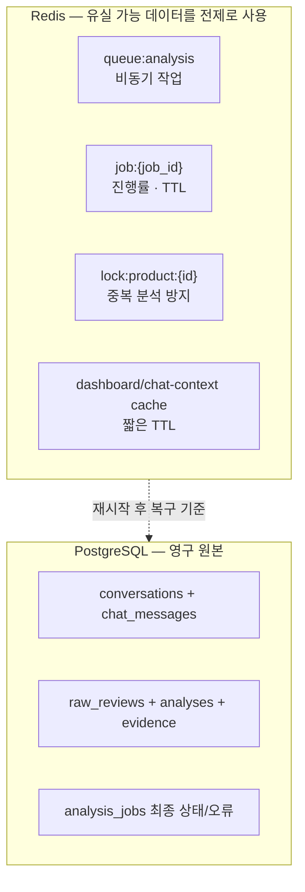

# 리뷰 기반 상품 개선 AI 서비스 설계

이 문서는 구현 전 합의를 위한 서비스 흐름과 입출력 계약이다. 핵심 경로는 다음과 같다.

> 상품 URL → 크롤링 → 리뷰 구조화 → Persona × Aspect 분석 → Issue/Strength → 개선 우선순위 → Seller Action → Dashboard/Chat/Word 보고서

## 1. 전체 런타임 아키텍처



### 컴포넌트 책임

| 컴포넌트 | 받는 값 | 하는 일 | 내보내는 값 |
|---|---|---|---|
| React | 상품 URL, 필터, 질문, 보고서 요청 | 입력 폼, 작업 진행률, 대시보드, Evidence 모달, 채팅 UI | FastAPI 요청 |
| FastAPI | 검증된 HTTP 요청 | 인증/인가, Pydantic 검증, 작업 등록, 조회 응답 조합 | JSON, SSE, DOCX |
| Async Worker | Redis 작업 메시지 | 크롤링, LLM 호출, 집계, 우선순위, 액션/보고서 생성 | PostgreSQL 레코드, 작업 상태 |
| PostgreSQL | 상품·리뷰·분석·대화 | 장기 보관하는 유일한 원본 저장소 | Dashboard/Chat/Report 컨텍스트 |
| Redis | job payload, cache key | 비동기 큐, 진행률, idempotency lock, 짧은 캐시 | worker job, cached response |

## 2. 상품 등록부터 대시보드까지

긴 크롤링과 AI 분석을 HTTP 요청 안에서 끝내지 않는다. 등록 API는 즉시 `202 Accepted`를 반환하고 React가 작업 상태를 조회한다.



### 작업 상태



## 3. Dashboard, Evidence, Chat, Report 흐름



## 4. API 입출력 계약

| 기능 | Method / Path | 주요 입력 | 성공 출력 |
|---|---|---|---|
| 상품 등록 | `POST /api/v1/products` | `ProductCreateInput` | `202 ProductJobOutput` |
| 작업 상태 | `GET /api/v1/jobs/{job_id}` | path `job_id` | `200 JobStatusOutput` |
| 상품 목록 | `GET /api/v1/products` | cursor, limit | `200 ProductListOutput` |
| Dashboard | `GET /api/v1/products/{id}/dashboard` | gender, height_bucket, weight_bucket, color, size, date range | `200 DashboardOutput` |
| Evidence | `GET /api/v1/products/{id}/evidence` | issue_id/aspect, sentiment, cursor | `200 EvidencePageOutput` |
| 대화 생성 | `POST /api/v1/products/{id}/conversations` | 선택적 title | `201 ConversationOutput` |
| 채팅 | `POST /api/v1/conversations/{id}/messages` | `ChatInput` | `200 SSE ChatChunk` |
| 보고서 | `GET /api/v1/products/{id}/report.docx` | 선택적 분석 버전 | `200 DOCX binary` |
| 재분석 | `POST /api/v1/products/{id}/analyses` | crawl 여부, 분석 기준일 | `202 ProductJobOutput` |

### 4.1 상품 등록

```json
{
  "source_url": "https://www.musinsa.com/products/6618666"
}
```

```json
{
  "product_id": "6618666",
  "job_id": "0195c9d3-7a44-7c43-a014-1a86a32f5042",
  "status": "queued",
  "status_url": "/api/v1/jobs/0195c9d3-7a44-7c43-a014-1a86a32f5042"
}
```

동일 상품의 활성 작업이 있으면 새 작업을 만들지 않고 같은 `job_id`를 반환한다. 이때 Redis의 `lock:product:{product_id}`를 쓰되, 최종 중복 방지는 PostgreSQL unique constraint로 보장한다.

### 4.2 작업 상태

```json
{
  "job_id": "0195c9d3-7a44-7c43-a014-1a86a32f5042",
  "product_id": "6618666",
  "status": "analyzing_reviews",
  "stage": "review_analysis",
  "progress": { "current": 80, "total": 240, "percent": 33 },
  "error": null
}
```

### 4.3 리뷰 분석 Worker 계약

크롤러의 현재 출력 필드와 맞춘 입력이다. `Description`, `description_raw`은 저장할 수 있지만 분석 컨텍스트에서는 제외한다.

```json
{
  "product_id": "6618666",
  "review_id": "86868095",
  "rating": 5.0,
  "date": "2026-08-11",
  "option": { "raw": "BROWN/S", "color": "BROWN", "size": "S" },
  "persona": {
    "gender": "여성",
    "height_cm": 153,
    "weight_kg": 46
  },
  "review_text": "옷의 디자인도 너무 예쁘고 색깔도 예쁘고 옷 두께도 딱 적당해서 여름에 많이 입을 것 같아요!",
  "like_count": 0
}
```

```json
{
  "review_id": "86868095",
  "persona": {
    "gender": "여성",
    "height_bucket": "150-154",
    "weight_bucket": "45-49",
    "color": "BROWN",
    "size": "S"
  },
  "aspects": [
    {
      "aspect": "DESIGN",
      "sentiment": "positive",
      "evidence_text": "옷의 디자인도 너무 예쁘고",
      "evidence_start": 0,
      "evidence_end": 14
    },
    {
      "aspect": "COLOR",
      "sentiment": "positive",
      "evidence_text": "색깔도 예쁘고",
      "evidence_start": 15,
      "evidence_end": 22
    }
  ]
}
```

`evidence_text`는 원문에 실제로 존재해야 한다. offset은 0부터 시작하고 `evidence_end`는 미포함(exclusive)이다. 서버가 substring/offset을 검증하며, 실패한 항목은 저장하지 않고 재시도 또는 검토 대상으로 보낸다.

### 4.4 Dashboard 출력

```json
{
  "product": {
    "product_id": "6618666",
    "product_name": "상품명",
    "brand_name": "브랜드",
    "price": 30100,
    "rating": 4.8,
    "review_count": 240,
    "analyzed_review_count": 238,
    "main_image_url": "https://...",
    "analysis_as_of": "2026-08-16T00:00:00+09:00"
  },
  "aspect_summary": [
    { "aspect": "DESIGN", "positive": 82, "negative": 7, "neutral": 3 }
  ],
  "issues": [
    {
      "issue_id": "issue_sleeve_length",
      "title": "소매 길이",
      "priority_rank": 1,
      "mention_count": 31,
      "negative_ratio": 0.78,
      "top_personas": ["160-164cm × M"],
      "evidence_preview": [
        { "review_id": "10212", "text": "소매가 생각보다 많이 길어요." }
      ]
    }
  ],
  "strengths": [],
  "persona_aspect_matrix": [],
  "option_summary": [],
  "seller_actions": []
}
```

### 4.5 Chat 입력과 스트림 출력

```json
{
  "message": "160cm대 여성의 M 사이즈 불만만 분석해줘.",
  "filters": {
    "gender": "여성",
    "height_bucket": ["160-164", "165-169"],
    "size": ["M"]
  }
}
```

```text
event: token
data: {"delta":"M 사이즈에서는 소매와 총장 관련 불만이..."}

event: evidence
data: {"items":[{"review_id":"30271","evidence_text":"키 162인데 M은 소매가 조금 깁니다."}]}

event: done
data: {"message_id":"01K...","unsupported_claims":[]}
```

판매량, 반품률, 매출 영향 등 저장소에 없는 값은 답변에 생성하지 않는다. 답변의 주요 판단은 `review_id` 또는 `issue_id`를 근거로 포함한다.

## 5. PostgreSQL 저장 모델



`issue_evidences`, `strength_evidences` 연결 테이블로 N:M 근거 관계를 보존한다. 분석 버전을 남겨 재분석 전후 결과와 당시 생성된 보고서의 근거를 재현할 수 있게 한다.

## 6. Redis에 둘 것과 두지 않을 것



- Redis에는 전체 대화 내역을 영구 저장하지 않는다.
- 대화 메시지는 먼저 PostgreSQL에 저장한 뒤 LLM을 호출한다.
- Redis 캐시가 사라져도 PostgreSQL에서 Dashboard와 대화를 다시 만들 수 있어야 한다.
- 작업의 최신 진행률은 Redis에, 최종 상태와 오류 요약은 PostgreSQL에 남긴다.

## 7. 구현 단위 제안

```text
frontend/
  src/pages/products, dashboard, chat
  src/features/product-registration, evidence-viewer, report-download

backend/
  app/api/v1/products.py, jobs.py, dashboard.py, conversations.py, reports.py
  app/schemas/                 # 위 입출력 Pydantic 모델
  app/services/crawler.py, analysis.py, aggregation.py, chat.py, report.py
  app/workers/tasks.py
  app/models/                  # SQLAlchemy 모델
```

MVP에서는 React가 작업 상태를 polling하고, 채팅 응답만 SSE로 스트리밍한다. 이후 작업 진행률도 SSE로 바꿀 수 있지만 API 출력 계약은 유지할 수 있다.

## 8. 구현 전 고정해야 할 규칙

1. 허용 URL은 `musinsa.com/products/{product_id}` 형태로 제한하고 서버에서 product ID를 재추출한다.
2. 크롤러 원본 필드의 `null`을 임의 추론으로 채우지 않는다.
3. `option`의 구분자(`/`, `·`)를 정규화하되 `option_raw`도 보존한다.
4. 이미지 파일은 저장하지 않고 URL 배열만 저장한다.
5. `Description`, `description_raw`은 분석 입력에서 제외한다.
6. 모든 Issue/Strength/Action은 최소 한 개 이상의 Evidence reference를 가진다.
7. 우선순위는 매출 영향이 아니라 언급 빈도, 부정 비율, 고객 규모, 최신성, 좋아요 수를 사용한 리뷰 기반 점수라고 화면에 명시한다.
8. LLM 출력은 JSON Schema/Pydantic 검증 후 저장하며, Evidence 원문 일치 여부를 별도 검증한다.
9. 재분석은 기존 결과를 덮어쓰지 않고 `version`을 올린다.
10. 사용자에게 노출하는 모든 오류 응답은 공통 형태 `{code, message, details?, request_id}`를 사용한다.
